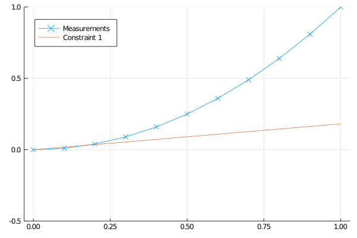

# PiecewiseLinearApprox

Helper functions to add convex (and concave) piecewise linear approximations of functions or a set of points, to optimization models modelled in [JuMP](https://jump.dev/). Currently supporting univariate functions. This package creates and solves a MILP to fit a set of points, and adds the resulting linear constraints to the optimization model. This work is partially based on [Toriello & Vielma, 2012](https://doi.org/10.1016/j.ejor.2011.12.030).

For non-convex functions, consider using [PiecewiseLinearOpt.jl](https://github.com/joehuchette/PiecewiseLinearOpt.jl).

## Usage

```julia
using JuMP, PiecewiseLinearApprox, Cbc

m = Model()
@variable(m, x)
@variable(m, test_z)
# Compute and add constraints approximating x^2 on the interval [0,1]
z = convex_pwlinear(m, x, x -> x^2, 0, 1, opt=Cbc.Optimizer; planes=5, z=test_z)
# Minimize
@objective(m, Min, z)
set_optimizer(m, Cbc.Optimizer)
# Check approximation/solution at x = 0.5
@constraint(m, x >= 0.5)
optimize!(m)
value(m[:test_z]) # 0.2533
```

To keep dependencies light, PiecewiseLinearApprox does not include plotting by default. If the Plots package is loaded
before using the module, some simple plotting routines will be available

The following demonstrates how this can be achieved:

```julia
using Plots, PiecewiseLinearApprox, Cbc

function plotquademo(N=3,opt=Cbc.Optimizer)
    x = [i for i in 0:0.1:1]
    z = x.^2
    pwl = convex_linearization(x,z,opt; planes=N)
    p = plot(x,z,seriestype=:scatter,markershape=:x,ylims=(-0.5,1))
    PiecewiseLinearApprox.plot!(p, pwl)
    
    return p
end

p = plotquademo()
savefig(p, "approx.svg")
```


Animation showing the accuracy when adding more cuts:

```julia
function gifdemo()
    anim = Animation()
    for i in 1:5
        frame(anim,plotquademo(i))
    end
    gif(anim,"approxanim.gif";fps=0.3)
end
```



[](https://github.com/invenia/BlueStyle)
