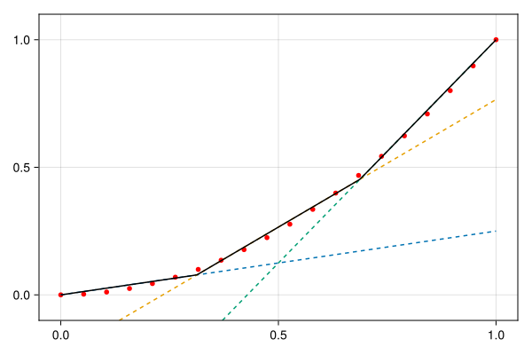
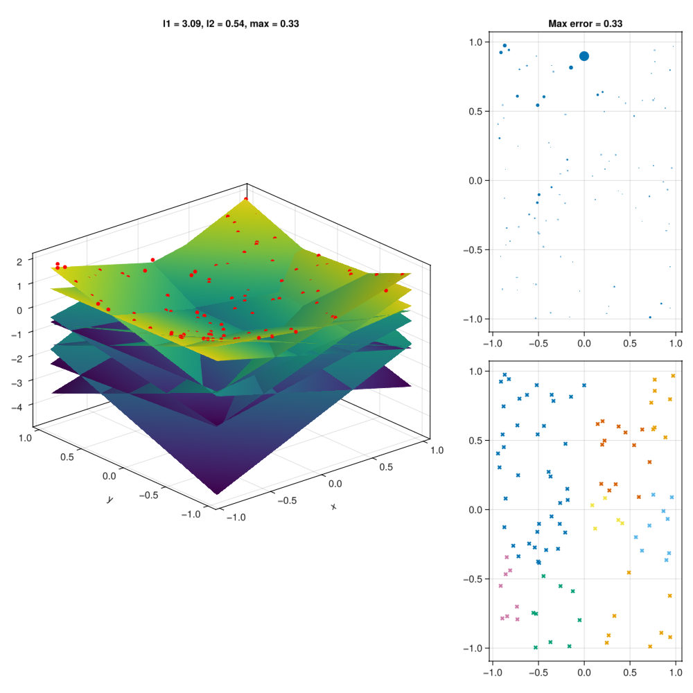

# PiecewiseAffineApprox

Add convex (or concave) piecewise linear approximations of functions or a set of points to optimization models modelled in [JuMP](https://jump.dev/). 

This package provides two main methods to fit a set of points: 

1. creates and solves a MILP to fit a set of points, and adds the resulting linear constraints to the optimization model. This method is partially based on [Toriello & Vielma, 2012](https://doi.org/10.1016/j.ejor.2011.12.030). 
2. uses a herusitic to fit the set of points. This method is based on [Magnani & Boyd, 2009](https://doi.org/10.1007/s11081-008-9045-3).

For non-convex functions, consider using [PiecewiseLinearOpt.jl](https://github.com/joehuchette/PiecewiseLinearOpt.jl).

## Usage

```julia
using JuMP, PiecewiseAffineApprox, HiGHS

m = Model(HiGHS.Optimizer)
@variable(m, x)
# Create a piecewise linear approximation to x^2 on the interval [-1, 1]
pwa = approx(x -> x[1]^2, [(-1, 1)], Convex(), Optimized(optimizer = HiGHS.Optimizer, planes=5))
# Add the pwa function to the model
z = pwaffine(m, x, pwa)
# Minimize
@objective(m, Min, z)
# Check approximation/solution at x = 0.5
@constraint(m, x >= 0.5)
optimize!(m)
value(z) # 0.2653
```

To keep dependencies light, PiecewiseAffineApprox does not include plotting by default. If the `Makie` or `Plots` package is loaded
before using the module, some simple plotting routines will be available

The following demonstrates how this can be achieved:

```julia
using PiecewiseAffineApprox, GLMakie, HiGHS

x = LinRange(0, 1, 20)
f(x) = first(x)^2
pwa = approx(f, [(0, 1)], Convex(), Optimized(optimizer = HiGHS.Optimizer, planes = 3))
p = plot(x, f.(x), pwa)

using CairoMakie
save("approx.svg", p; backend=CairoMakie)
```


Animation showing the accuracy when adding more cuts:
<details>
  <summary>Show me the code</summary>

```julia
function pwademo(x, f, Ns = 1:5; opt = HiGHS.Optimizer, C = Convex())
    fig = Figure(size = (600, 400))
    ax = Axis(fig[1, 1])

    scatter!(ax, x, f.(x), color = :red, markersize = 8)

    linerecords = []
    for n in Ns
        add_mplane!(ax, x, f, C, opt, n, linerecords)
        sleep(1)
    end

    return (; fig, ax, linerecords)
end

function add_mplane!(ax, x, f, C, opt, n, linerecords)
    x̄ = LinRange(minimum(x), maximum(x), 100)
    pwa = approx(f, [(0, 1)], C, Optimized(optimizer = opt, planes = n))
    for ol in linerecords
        delete!(ax, ol)
    end
    empty!(linerecords)

    en = [-Inf for _ in x̄]
    # Plot each cutting plane
    for plane ∈ pwa.planes
        l = [evaluate(plane, i, C) for i ∈ x̄]
        nl = lines!(ax, x̄, l, linestyle = :dash)
        push!(linerecords, nl)
        en = max.(en, l)
    end
    # Plot effective envelope
    e = lines!(ax, x̄, en, color = :black)
    return push!(linerecords, e)
end

# Create animation
record(p.fig, "docs/approxanim.mp4") do io
    for n = 1:5
        add_mplane!(p.ax, x, f, Convex(), HiGHS.Optimizer, n, p.linerecords)
        for _ = 1:30
            recordframe!(io)
        end
    end
end
```
</details>

<video loop src="docs/approxanim.mp4">video </video>

Approximation of 3D function

 <video loop src="docs/rotation.mp4">  video </video> 


```julia
I = 100
xmat = 2 * rand(2, I) .- 1
x = [Tuple(xmat[:, i]) for i = 1:size(xmat, 2)]
z = [p[1]^2 + p[2]^2 for p in x]
vals = FunctionEvaluations(x, z)
pwa = approx(
    vals,
    Convex(),
    Heuristic(; optimizer = HiGHS.Optimizer, planes = 9, strict = :none),
)
p = plot(vals, pwa)
save(joinpath(@__DIR__,"..","docs","approx_3D.png"), p)

```

