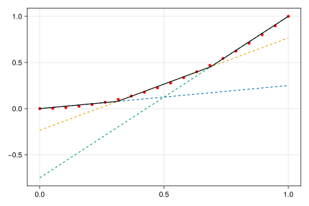

# Plot approximation

Some plotting functons are available for visualization of piecewise affine approximations using standard backend packages [`Makie`](https://docs.makie.org/stable/) or [`Plots`](https://docs.juliaplots.org/stable/). 


### 2D
The following code shows how to the use of a plotting function with Makie:

```julia
using PiecewiseAffineApprox, GLMakie, HiGHS

x = LinRange(0, 1, 20)
f(x) = first(x)^2
pwa = approx(f, [(0, 1)], Convex(), Optimized(optimizer = HiGHS.Optimizer, planes = 3))
p = plot(x, f.(x), pwa)

using CairoMakie
save("approx.svg", p; backend=CairoMakie)
```


### 3D
Default plot with 3D plot and error distribution for all points as well as allocation to planes for each plot (for `Heuristic`)

```julia
using PiecewiseAffineApprox, GLMakie, HiGHS

I = 100
xmat = 2 * rand(2, I) .- 1
x = [Tuple(xmat[:, i]) for i = 1:size(xmat, 2)]
z = [p[1]^2 + p[2]^2 for p in x]
vals = FunctionEvaluations(x, z)
pwa = approx(
    vals,
    Convex(),
    Heuristic(; optimizer = HiGHS.Optimizer, planes = 9, strict = :none),    
)
p = plot(vals, pwa)

using CairoMakie
save("approx_3D.png", p; backend=CairoMakie)
```


